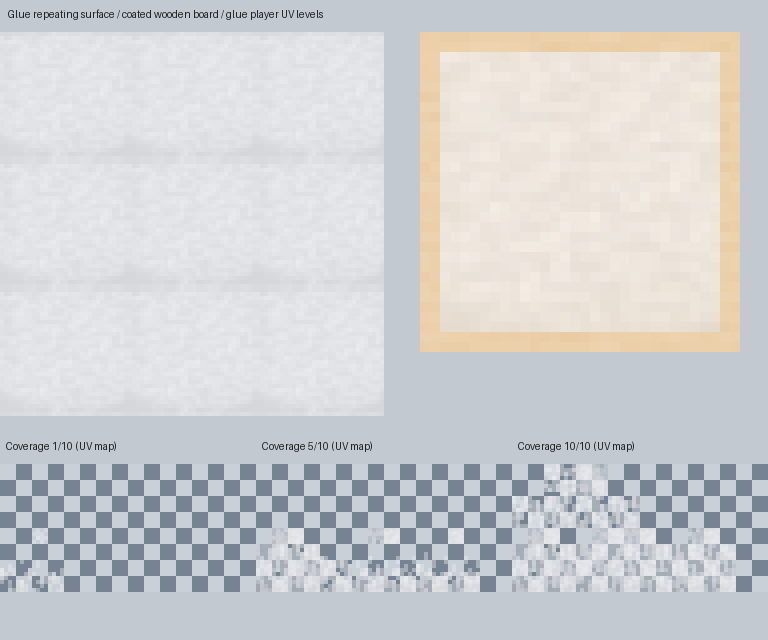

# 胶水与粘鼠板素材

2026-10-06，按已批准的胶水玩法设计制作。使用内置 `image_gen.imagegen`，分别生成乳白半透明浓稠胶水、浅色木纤维底材；未替换已有泥潭、焦油、蜂蜜或黏液纹理。

完整提示词与生成参数见 [inputs.json](inputs.json)，原始生成图在 `sources/glue.png`、`sources/wood.png`。用户已授权脚本缩放、制作循环动画和按原 UV 生成透明蒙层。所有源图只放在文档目录；运行时 JAR 只收录 `src/main/resources` 中的 16 张新贴图和 2 份动画元数据。

处理脚本：[refresh_adhesive_textures.py](../../tools/refresh_adhesive_textures.py)，需要 Python 3.11+、Pillow、NumPy。

```powershell
python tools/refresh_adhesive_textures.py --bake --verify
python tools/refresh_adhesive_textures.py --verify
```

生成流程：胶水源图以 BOX 缩小到 32 像素，限制 24 级灰白调色板；保留生成图的透明度变化并围绕 180/255 归一化，避免伪棋盘或水状透明。对每一帧焊接相对边缘，周期性轻微褶皱和色调变化形成缓慢浓稠流动。流动贴图在每帧使用同一 32 像素图块重复 2×2，以匹配 Minecraft 流体的 UV 采样域。动画帧 0 的 still/flow 材质一致。

## 渲染契约

- `blocks/glue_still.png`：32×1024，32 帧，每帧 32×32。
- `blocks/glue_flow.png`：64×2048，32 帧，每帧 64×64，每帧重复四个 32×32 图块。
- 两种流体动画：`frametime: 3`，`interpolate: false`，运行时实际 alpha 范围 161–187，平均约 179.5。流体应使用半透明渲染层。
- `blocks/stickyboard_wood.png`：32×32，不透明浅木底材。
- `blocks/stickyboard_glue.png`：32×32，2 像素透明边缘，中心为乳白半透明胶层；适合作为底板上方略偏移的贴面，避免两个共面的面闪烁。
- `items/bucketofglue.png`：32×32，从蜂蜜桶的现有桶轮廓与 alpha 派生，只将可识别的内部液体替换为乳白胶水，桶金属外框保持原样。
- `entity/adhesive_strand.png`：32×32，中性灰白基色，alpha 约 180，可供程序生成黏膜和拉丝的半透明几何使用；渲染按胶水、焦油、蜂蜜等介质着色。材质没有额外外轮廓；几何本身控制拉丝形状。
- `entity/mudoverlays/glueoverlay0.png` 至 `glueoverlay9.png`：128×64，沿用已有 `slimeoverlay` 的 legacy UV 布局和 10 级覆盖区域。每个像素 alpha = `round(原 alpha × 180 / 255)`，非零覆盖支持完全相同，各级平均覆盖严格递增。模型仍使用原来的 64×32 归一化 UV；胶水层建议白色 tint，避免沿用泥层的棕色。

`sources/masks/` 和 `sources/bucketofhoney-reference.png` 是派生依据的快照，保证重烘焙不受未来旧素材改动影响。`protected-textures.json` 记录生成前所有旧纹理和元数据的哈希，验证会确认它们没有被本次生成修改。

`manifest.json` 记录所有新资源的大小、SHA-256、动画与模板字段。验证覆盖逐帧边缘相等、流动重复、透明度范围、动画循环衔接、10 级 UV alpha 区域、覆盖递增、桶轮廓、底板透明边缘、源图与输出哈希和旧资源未改动。



预览只用于素材验收，不代表在游戏中完成了几何、着色和动画姿势验证；集成后的客户端回归由主任务运行。

## 2026-10-07 视觉调整

使用内置 image_gen 新生成 [设计参考图](design-reference.png)，展示白色半透明胶水、薄木板与足踝拉丝，以及蜂蜜、焦油、泥的不同材质。此图是概念参考，不能代替游戏截图，也不会进入运行时 JAR。

提示词要点：Minecraft 像素材质；乳白半透明厚胶水、银色胶水桶、浅色可重复使用的薄木板；黏膜包住足踝和小腿，多条胶丝连接鞋底与板面；蜂蜜金黄、焦油近黑、泥土棕色；无文字、水印、尖刺或机械捕兽装置。完整提示词见 design-reference-prompt.txt。

实际游戏截图显示原 209/255 平均灰白基色偏灰，因此将新胶水材质的亮度中心提高为 237/255，同时保留源图褶皱、真实 alpha、循环帧和 UV。黏丝灯光分别采样锚点与暴露的腿部，保留洞穴／夜间照明，不使用自发光。旧材质哈希保护继续保留。
