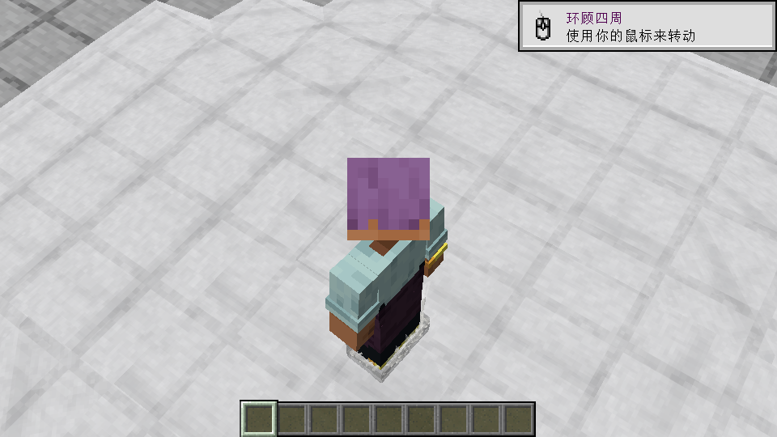
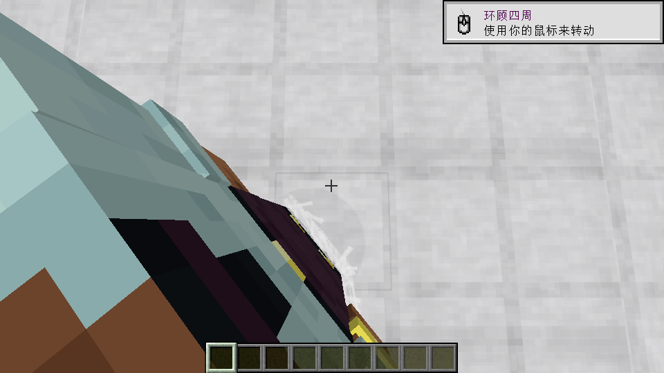

# 0.6.8-dev 湿黏薄壳与连续立体黏丝验收

## 交付

目标 Minecraft 1.21.11 / NeoForge 21.11.45 / Java 21，协议 6。

产物 `build/libs/MFQM-neoforge-1.21.11-0.6.8-dev.jar`，2,490,755 字节，SHA256：

```
16dbd05a8dcf0617379c442e5e8236397e5e28890fed07af1d995611b5595a5b
```

每接触只有一根连续黏丝，具有封闭六边截面，不再分叉。胶水及涂胶板的黏丝半径较首次连续版加倍，根部仍限制在实际介质内部；其他材质宽度保持。每脚一层薄壳，有内外壁和 0.003 格厚度边缘，浅层停在脚踝、深层延伸到小腿。原生尺寸和姿势决定贴脚形状，FirstPersonModel 的同帧坐标保留。胶水、焦油、蜂蜜、黏液和涂胶板沿用各自颜色；短丝拉伸变细、松弛弯曲、断裂回缩。

活动范围、走跑短跳、64 个物理接触和原近脚淡出规则沿用；胶水池表面仍为既有流体。与已验收 0.6.7 JAR（SHA256 `d3efa82f58f0311e79acddbcee5e1c913931b37f396045bf2deb112ad7856c6d`）对比，132 个非客户端类、2054 个资源／数据文件完全一致。没有新增位图。README、玩法说明及设计已同步，工作仅在工作目录，无新署名或远程发布。

## 自动化与审查

- 先观察一接触一根断言拒绝五分叉实现、缺少材质加粗接口的编译失败，再完成实现。
- 最终 `gradlew build prepareInstalledClient -PmfqmClientChecks` 通过。湿黏几何 1780 项、短丝策略 17 项；其余运动 35 组、阻力边界 35 项、覆盖高度 23 项、黏连 241 项、接触／根部 78 项、范围／短跳 112 项、覆盖外观 12 项、像素覆盖 388 项、挣扎 739 项、姿态 378 项。
- Python 工具 30 项回归通过；最终 JAR 的 verify_jar.py 通过，verify_port.py 为 0 错误。
- 主代理需求与质量审查见 [review.md](review.md)，未新派子代理。

## 最终 JAR 的实际游戏

在工作区隔离存档、mods 中实际 JAR 上验证，代码来源断言排除了开发类加载，所有受困场景检查关闭飞行。合载 FirstPersonModel 2.7.3、3D Skin Layers 1.11.3、Not Enough Animations 1.12.6，见 [coating-final-pass.log](coating-final-pass.log)。

站立、潜行、转身、视角切换、F6 关闭／开启通过，实际身体与黏丝脚点最大误差约 `1.34e-7` 格。真实短跳仍保留 64 个同步物理接触；近脚可见 49 个接触、49 根连续黏丝，每接触恰好一个封闭管，没有分叉，胶水实际半径加倍。双脚恰好两层薄壳，端点贴合薄壳，根部在真实介质内。另通过 60 个原生姿态模型的方向／尺寸检查、600 个身体覆盖组合、五类材质真实提交、资源重载及显示强度零值检查。

保存并视觉检查了三张必要游戏截图。第三人称近景仅在隔离可视化夹具临时使用 FOV 35，结束恢复；生产束缚没有调整 FOV。





身体覆盖合载：[mfqm-glue-coating-skinlayers.png](mfqm-glue-coating-skinlayers.png)。

## 同一物理实现的其他回归证据

这些检查在较早候选 JAR 上运行，最终的 132 个非客户端类保持字节码一致；没有将较早日志冒充最终加粗版的全部场景重测。

[actions-physics-pass.log](actions-physics-pass.log) 对应候选 SHA256 `61b826a7bff8d4090e7cd49904c6473778c4c4eae55eb5cc8e58eb855d608f0d`：胶水 W 移动 120 tick 距离约 1.248 格；静止不继续下陷，五次真实 F 累计下陷 0.05 格且停止后不重播；救援一次生效并到期，普通行走恢复，真实受击后自然落地。已涂胶板真实放置生效，行走约 0.709 格、FOV 倍率 1.0，短跳峰值约 0.26 格，33 次 F 后脱困，离板行走约 12.476 格。这是定向回归，非全部 23 介质场景重测。

[dynamic-pass.log](dynamic-pass.log) 对应候选 SHA256 `273fa4d54ee64d55b069d73a9514c61a8ca5967852e62c40c14c8627bd7d4e3b`：真实 W/S 形成 64 个同步接触，显示预算设 16 后物理仍为 64，双脚膜恰好两层。显示预算代码在最终版本未修改，最终合载另检查了 64 接触。

较早的分叉候选记录保存在 coating-first-pass.log 和 forked-candidate-pass.log，仅为过程证据。continuous-thin-pass.log 是加粗前连续版（SHA256 `9e40dcb67f164414f251d7e09b9f9c45d3ccadd68fc061c68bd0e8c2c4a194b3`）。交付只采用本文开头哈希。

## 边界

未完成版本出现过一次短跳时的连接数量断言失败，原始 [jump-contact-failure.log](jump-contact-failure.log) 保留。当时缺少具体数量，原因不能确定；补充有界的同步数量诊断后，多个候选及最终版本通过，没有降低断言或改物理。

可选模组及内嵌库既有的资源包格式 75 缺少 supported_formats 错误仍记录，仅准确匹配已知消息放行。没有多人高密度帧率基准，皮肤透明洞尚未逐像素贴合；其他黏性介质共用几何和原颜色，近景重点为胶水。桌面副本及用户实际游戏实例未改动。
