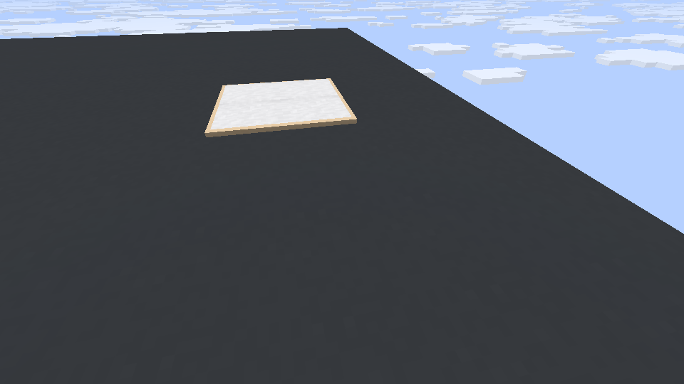
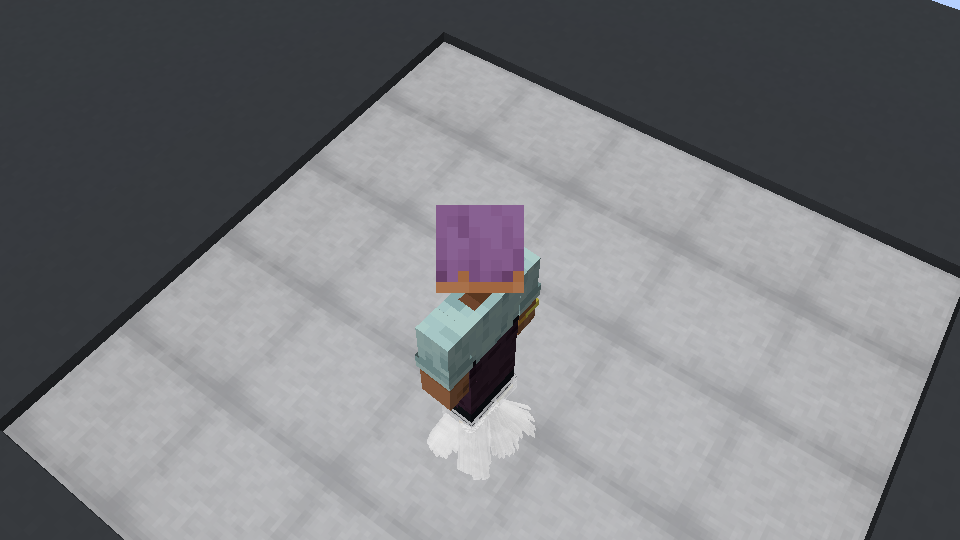

# 0.7.1-dev 简化验收

目标：Minecraft 1.21.11 / NeoForge 21.11.45 / Java 21。

## 修改

黏丝介质端延伸到所在格底部附近，通常中心距底部 0.06 格；浅液体和涂胶板保留实际厚度约束。加宽胶带，提高可见度，减小收腰与下垂。身体端、无分叉立体截面、密度设置与物理活动范围保持现有规则。

粘鼠板接缝原先采样了原 PNG 的两像素透明框，导致模型虽然连通仍露出木色十字。现在胶面 UV 仅采样有效内部像素，边缘延伸填满接缝；旧存档连接在区块完成加载后自动刷新。

实际用户实例之前加载的是 0.6.9-dev，SHA256 `84a8e640a8d53ed0297201242257e1e11bce9f1c6b17773be6a4a86e8dc8d426`，没有拼接 multipart 模型。日志与 JAR 均已核实。

## 验证

- `verifyWetAdhesiveStyle`：2156 项，包含根部近底、固定身体端更陡、宽度、平顺收腰、闭合网格和端面范围。
- `verifyCompactStrandStyle`：92 项。
- `tools/connected_boards.py --verify`：128 种胶量/连接组合，增加实际 PNG 透明度检查。
- 启动器单元检查：13 项。
- `verify_jar.py`、`verify_port.py`：打包资源检查通过。
- `smoke_viscosity_client.py --visual-only`：从隔离实例的 mods JAR 加载，检查真实物品放置的 2×2 板、拆除、旧属性刷新、跨区块连接、实际烘焙胶面每格 225 像素覆盖；角色从未飞行。
- 最终场景：54 个实际物理接触、432 根可见独立胶带，所有根部本地 Y 约 0.06，完整端面均在胶水内。
- 已查看两张游戏截图：内部十字木边消失、仅外围保留木边；胶带在脚边密集可见。

最终安装测试 JAR SHA256：`4ed18f87d073a6873158e4387ebcb617d49c81d1fc6fcf3fe0824cfc6b4efb9b`。

确认目标游戏进程关闭后，已将同一哈希的 0.7.1-dev 安装到用户指定实例。旧 0.6.9-dev 保存在该实例的 `mfqm-backups/0.7.1-dev-20261009-023634/`，mods 内仅保留新 MFQM；其他模组、配置和用户存档未修改。

未重跑完整玩法、兼容模组矩阵或性能测试。GitHub 仍为已发布的 0.7.0 预发布版，桌面源码副本不在本轮修改范围。
